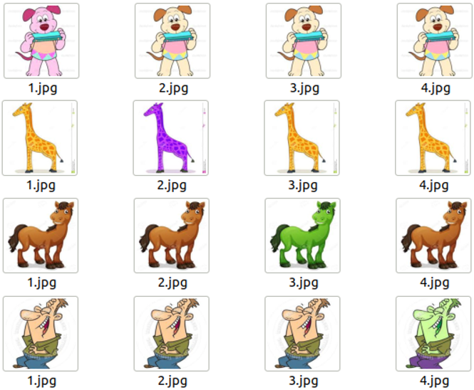
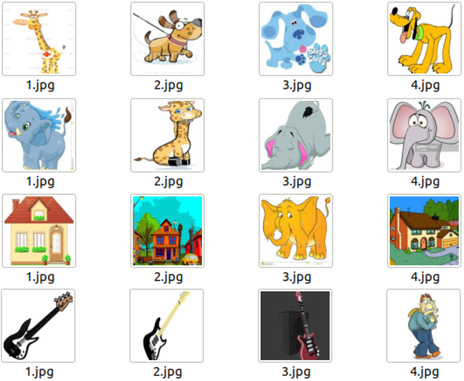
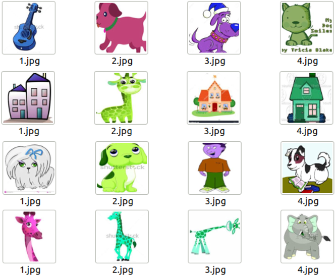
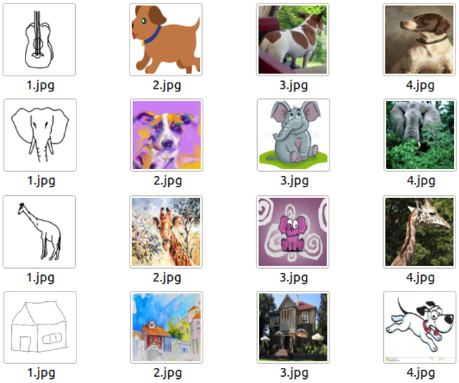
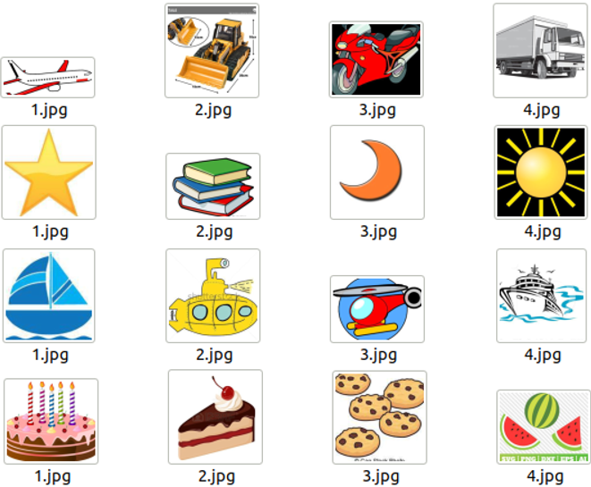

# AIML_project_dataset

* **dataset_1** 
	Each set contains three identical images and the same image with different colors.
          
    
* **dataset_2** 
	Each set contains three different images belonging to the same class and one image from a different class.
          

* **dataset_3** 
	Like dataset_2, but the RGB channels of the four images are randomly reversed.
          

* **dataset_4** 
	Each set contains three different images belonging to the same class but different domain and one image from different class and random domain.
          
     
* **dataset_5** 
	Each set contains three completely different but semantically related images and an odd.
