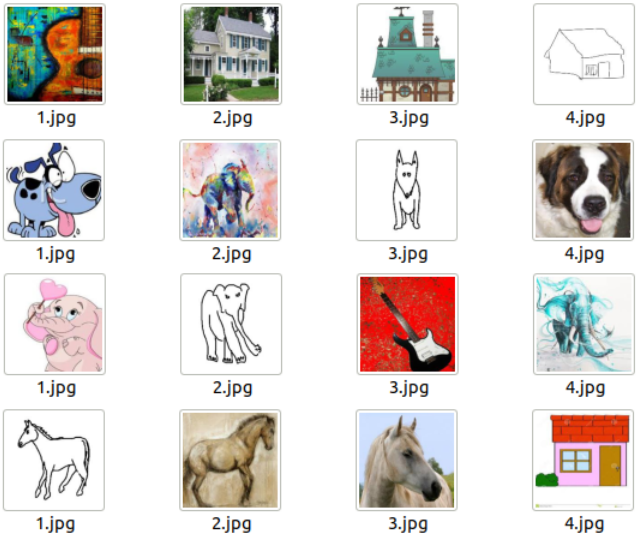

# AIML_project_dataset

The first three types of datasets are generated starting from the *cartoon* domain of the *PACS* database, the fourth is the result of the union of all PACS domains and for the last one the *clipart* category of the *DomainNet* database is used. 
The *scripts* folder contains the python scripts used for the generation of the datasets whereas in the *csv_file* there is the list of all the semantic quaterne created for the fifth dataset.

* **dataset_1** 
	Each set contains three identical images and the same image with different colors.
             
    
* **dataset_2** 
	Each set contains three different images belonging to the same class and one image from a different class.
             

* **dataset_3** 
	Like dataset_2, but the RGB channels of the four images are randomly reversed.
             

* **dataset_4** 
	Each set contains three different images belonging to the same class but different domain and one image from different class and random domain.
             
     
* **dataset_5** 
	Each set contains three completely different but semantically related images and an odd.
